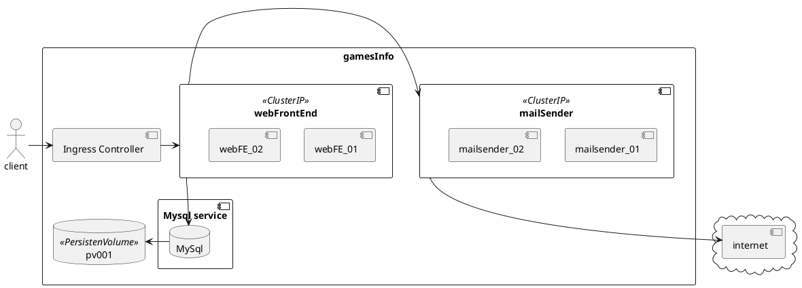

# Memoria de la practica de Cloud Computing 


## ToC
<!-- toc -->

- [Estructura elegida para el deployment](#Estructura-elegida-para-el-deployment)
  * [Web Front End](#Web-Front-End)
    + [Imagen docker](#Imagen-docker)
    + [Deployment](#Deployment)
    + [Service](#Service)
    + [Valores relevantes](#Valores-relevantes)
  * [MailSender](#MailSender)
    + [Imagen docker](#Imagen-docker-1)
    + [Deployment](#Deployment-1)
    + [Servicio](#Servicio)
    + [Valores relevantes](#Valores-relevantes-1)
  * [Base de Datos](#Base-de-Datos)
    + [Creacion del `Persistent Volume`](#Creacion-del-Persistent-Volume)
    + [Nuevo requerimiento](#Nuevo-requerimiento)
    + [Configuracion del chart.](#Configuracion-del-chart)
    + [Obtencion del chart](#Obtencion-del-chart)
- [Adaptación de la aplicación al entorno kubernetes](#Adaptacion-de-la-aplicacion-al-entorno-kubernetes)
  * [From Ip to ServiceNames](#From-Ip-to-ServiceNames)
  * [Configuracion Hazelcast](#Configuracion-Hazelcast)
- [Configuraciones adicionales en k8s](#Configuraciones-adicionales-en-k8s)
    + [Hazelcast](#Hazelcast)
    + [Ingress](#Ingress)
    + [Ingress Controller](#Ingress-Controller)
    + [Generacion de certificados.](#Generacion-de-certificados)
    + [Certificado.](#Certificado)
- [Deployment de la aplicacion en minikube](#Deployment-de-la-aplicacion-en-minikube)
  * [:warning: Disclaimer :warning:](#warning-Disclaimer-warning)
  * [Prerrequisitos](#Prerrequisitos)
    + [VirtualBox](#VirtualBox)
    + [Docker](#Docker)
    + [Minikube](#Minikube)
    + [Helm](#Helm)
    + [Kubectl](#Kubectl)
  * [Despliegue](#Despliegue)
    + [1.- Creacion de las imagenes](#1--Creacion-de-las-imagenes)
      - [1.1 Utilizando el registry de minikube](#11-Utilizando-el-registry-de-minikube)
      - [1.2 Construimos las imagenes](#12-Construimos-las-imagenes)
  * [Configuracion del ingress en minikube](#Configuracion-del-ingress-en-minikube)
  * [Configuracion del hostname](#Configuracion-del-hostname)
  * [Lanzamiento de la aplicacion mediante helm](#Lanzamiento-de-la-aplicacion-mediante-helm)
  * [Visualizacion del resultado](#Visualizacion-del-resultado)
- [Explicacion del fichero de valores `values.yaml`](#Explicacion-del-fichero-de-valores-valuesyaml)

<!-- tocstop -->

## Estructura elegida para el deployment
Segun los requisitos del enunciado el despliegue debe realizarse en minikube.




### Web Front End
Segun los requisitos:
- El frontal web debe desplegarse con **dos** replicas 
  Para poder tener multiples instancias controladas por k8s se ha dispuesto un `Deployment`[^deployments] con dos replicas.
  
- El frontal debe quedar expuesto al exterior. 
  Para poder exponer al exterior este servicio se deberia haber elegido un servicio k8s de tipo `LoadBalancer`, sin embargo como se va a utilizar un **ingress controller**[^ingress_controller] para poder exponer el servicio al exterior se ha optado por utilizar un servicio de tipo `ClusterIP`.[^service_types]
 
No necesitamos ningun tipo de elemento adicional para balancear la carga entre las dos instancias del frontal web puesto que esta caracteristica nos la ofrece k8s out of the box.

#### Imagen docker
Para poder desplegar el frontal web en kubernetes necesitamos una imagen docker. 
Para construirla a partir del proyecto actual utilizamos el siguiente fichero `Dockerfile`, que puede encontrarse en `./prueba_servidor/Dockerfile`

```Dockerfile
FROM maven:3.6.0-jdk-8-alpine as builder
RUN mkdir /project
COPY ./pom.xml /project/pom.xml
WORKDIR /project
RUN mvn dependency:go-offline
COPY src/ /project/src/
RUN mvn package

FROM ubuntu:trusty
RUN sudo apt-get update && sudo apt-get install -y software-properties-common wget unzip && sudo add-apt-repository ppa:openjdk-r/ppa && sudo apt-get update
RUN sudo apt-get install -y openjdk-8-jre
RUN mkdir /servidor
WORKDIR /servidor
COPY --from=builder /project/target/prueba_servidor-0.0.1-SNAPSHOT.jar /servidor
EXPOSE 8080
CMD java -jar /servidor/prueba_servidor-0.0.1-SNAPSHOT.jar --spring.datasource.url="jdbc:mysql://jlojosnegros-mysql-svc:3306/gamesinfo_db?verifyServerCertificate=false&useSSL=true" --spring.datasource.username="root" --spring.datasource.password="gugus" --spring.jpa.hibernate.ddl-auto="update"
```
:warning: el nombre de la url, password, y nombre de la base de datos pasados como parametros tienen que coincidir con los configurados en el fichero de `values.yaml` para el servicio de mysql

Para la construccion de esta imagen docker se ha utilizado:
- Un dockerfile multistage para no tener instaladas en la imagen final herramientas que solo son necesarias en la construccion del proyecto
- Una capa independiente para la descarga de las dependencias del proyecto maven. Esto se realizo en un intento por paliar la "caracteristica" de maven de descargarse medio internet antes de cada compilacion, y ante la imposibilidad de compartir directorios del host en la construccion de una imagen docker. 
  Utilizamos esta capa a modo de "cache" de dependencias, de manera que mientras que no cambiemos el fichero `pom.xml` no tendremos la necesidad de descargarlas de nuevo. 
  ```Dockerfile
  RUN mvn dependency:go-offline
  ```
  
#### Deployment
`./k8s/gamesInfo/templates/webFE_deployment.yaml)`[^webFE_deployment]
```yaml
apiVersion: apps/v1
kind: Deployment
metadata:
  name: {{ include "gamesInfo.fullname" . }}-webfe-deploy
  labels:
    app: {{ .Values.global.appName}}
    tier: {{ .Values.webFE.tier}}
spec:
  strategy:
    type: Recreate
  selector:
    matchLabels:
      app: {{ .Values.global.appName}}
      tier: {{ .Values.webFE.tier}}
  replicas: {{ .Values.webFE.replicaCount}} # tells deployment to run 1 pods matching the template
  template: # create pods using pod definition in this template
    metadata:
      labels:
        app: {{ .Values.global.appName}}
        tier: {{ .Values.webFE.tier}}
    spec:
      containers:
      - name: {{ include "gamesInfo.fullname" . }}-webfe-container
        image: "{{ .Values.webFE.image.repository}}:{{ .Values.webFE.image.tag}}"
        imagePullPolicy: {{ .Values.webFE.image.pullPolicy}}
        ports:
        - containerPort: {{ .Values.webFE.port}}
        - containerPort: {{ .Values.webFE.hazelcast.port}}
      initContainers:
      - name: init-mailservice
        image: busybox
        command: ['sh', '-c', 'until nslookup {{.Values.mailSender.serviceName}}; do echo waiting for {{.Values.mailSender.serviceName}}; sleep 2; done;']
      - name: init-mysql
        image: busybox
        command: ['sh', '-c', 'until nslookup {{.Values.mysql.fullnameOverride}}; do echo waiting for {{.Values.mysql.fullnameOverride}}; sleep 2; done;']
```

#### Service

fichero: `./k8s/gamesInfo/templates/webFE_service.yaml`[^webFE_service]
```yaml
apiVersion: v1
kind: Service
metadata:
  name: {{.Values.webFE.serviceName | quote}}
  labels:
    app: {{ .Values.global.appName}}
    tier: {{ .Values.webFE.tier}}
spec:
  ports:
  - name: hazelcast
    port: 5701
  - name: "{{.Values.global.appName}}-webport"
    port: {{ .Values.webFE.port}}
  selector:
    app: {{ .Values.global.appName}}
    tier: {{ .Values.webFE.tier}}
  type: {{ .Values.webFE.serviceType}}
```
#### Valores relevantes 
Aqui podemos ver la seccion relevante del fichero de valores `values.yaml`
```yaml
global:
  appName: jlojosnegros

webFE:
  replicaCount: 1
  tier: front-end
  image:
    repository: prueba_servidor
    tag: latest
    pullPolicy: IfNotPresent
  serviceType: ClusterIP
  serviceName: webfe-svc
  port: 8080
  hazelcast:
    port: 5701
```
### MailSender
Segun los requisitos:
- este servicio debe desplegarse con **dos** replicas.
  Para ello se tiene un `Deployment`[^deployments] con dos replicas.
  
- NO debe estar expuesto al exterior.
  Para poder exponer las replicas existentes como un solo servicio, sin tener que exponerlo externamente al cluester, se ha optado por un servicio de tipo `ClusterIP`[^service_types]

De nuevo como en el caso anterior, no necesitamos de ningun elemento adicional para realizar balanceo de carga entre las dos instancias levantadas puesto que esta caracteristica la provee k8s.

#### Imagen docker
Para poder desplegar el frontal web en kubernetes necesitamos una imagen docker. 
Para construirla a partir del proyecto actual utilizamos el siguiente fichero `Dockerfile`, que puede encontrarse en `./mailService/Dockerfile`[^mailService_dockerfile]

```Dockerfile
FROM maven:3.6.0-jdk-8-alpine as builder
RUN mkdir /project
COPY ./pom.xml /project/pom.xml
WORKDIR /project
RUN mvn dependency:go-offline
COPY src/ /project/src/
RUN mvn package

FROM ubuntu:trusty
RUN sudo apt-get update && sudo apt-get install -y software-properties-common wget unzip && sudo add-apt-repository ppa:openjdk-r/ppa && sudo apt-get update 
RUN sudo apt-get install -y openjdk-8-jre
RUN mkdir /mailService
WORKDIR /mailService
COPY --from=builder /project/target/mailService-0.0.1-SNAPSHOT.jar /mailService
EXPOSE 8080
CMD java -jar /mailService/mailService-0.0.1-SNAPSHOT.jar
```
En este dockerfile se han utilizado las mismas tecnicas que se nombran en la construccion del dockerfile del frontal web.

#### Deployment
fichero `./k8s/gamesInfo/templates/mailsender_deployment.yaml`[^mailsender_deployment]
```yaml
apiVersion: apps/v1
kind: Deployment
metadata:
  name: {{ include "gamesInfo.fullname" . }}-mailsender-deploy
  labels:
    app: {{.Values.global.appName}}
    tier: {{.Values.mailSender.tier}}
spec:
  strategy:
    type: Recreate
  selector:
    matchLabels:
      app: {{ .Values.global.appName}}
      tier: {{ .Values.mailSender.tier}}
  replicas: {{ .Values.mailSender.replicaCount}}
  template:
    metadata:
      labels:
        app: {{ .Values.global.appName}}
        tier: {{ .Values.mailSender.tier}}
    spec:
      containers:
      - name: {{ include "gamesInfo.fullname" . }}-mailsender-container
        image: "{{ .Values.mailSender.image.repository}}:{{ .Values.mailSender.image.tag}}"
        imagePullPolicy: {{ .Values.mailSender.image.pullPolicy}}
        ports:
        - containerPort: {{ .Values.mailSender.ports.internalPort}}
      initContainers:
      - name: init-mysql
        image: busybox
        command: ['sh', '-c', 'until nslookup {{.Values.mysql.fullnameOverride}}; do echo waiting for {{.Values.mysql.fullnameOverride}}; sleep 2; done;']
```

#### Servicio
fichero `./k8s/gamesInfo/templates/mailsender_service.yaml`[^mailsender_service]
```yaml
apiVersion: v1
kind: Service
metadata:
  name: {{.Values.mailSender.serviceName | quote}}
  labels:
    app: {{ .Values.global.appName}}
    tier: {{ .Values.mailSender.tier}}
spec:
  ports:
  - port: {{ .Values.mailSender.ports.internalPort}}
    protocol: TCP
    name: "{{.Values.global.appName}}-mailport"
  selector:
    app: {{ .Values.global.appName}}
    tier: {{ .Values.mailSender.tier}}
  type: {{ .Values.mailSender.serviceType}}
```
#### Valores relevantes
Parametros relevantes dentro del fichero de valores `values.yaml`

```yaml
global:
  appName: jlojosnegros

mailSender:
  replicaCount: 1
  tier: back-end
  image:
    repository: mailservice
    tag: latest
    pullPolicy: IfNotPresent
  serviceType: ClusterIP
  serviceName: mailsender-svc
  ports:
    # warning: Do NOT change this port unless you also change mailService java app configuration also.
    internalPort: 8080 #port where the mail service is listeninig incoming commands from webFE 
```

### Base de Datos
Segun los requisitos la base de datos tenia que utilizar un `Persistent Volume`[^persistent_volumes] en el cluster de k8s para guardar los datos.

La base de datos utilizada por el proyecto es "MySQl", de modo que utilizaremos un helm chart oficial de mysql para este proposito, y personalizaremos algunos valores utilizando para ellos el fichero `values.yaml`

#### Creacion del `Persistent Volume`
La base de datos utiliza como storage un persisten volume en el cluster de minikube. 
Para ello tenemos que crear el persisten volume como parte del despliegue de nuestra aplicacion.
Este `persistent volume` sera configurado mas adelante en el chart del mysql para ser usado como storage de la base de datos. (#k8s/gamesInfo/templates/pv.yaml)
```yaml
apiVersion: v1
kind: PersistentVolume
metadata:
  name: pv001
  labels:
    type: local
    app: {{ .Values.global.appName}}
spec:
  storageClassName: {{ .Values.pv.storageClass}}
  capacity:
    storage: 10Gi
  accessModes:
    - ReadWriteOnce
  hostPath:
    path: {{ .Values.pv.path}}
```
Como vemos algunos de los valores estan parametrizados mediante el fichero `values.yaml`
```yaml
global:
  appName: jlojosnegros
pv:
  storageClass: jlom
  path: "/mnt/data"
```

#### Nuevo requerimiento
Para poder utilizar el char de mysql tendremos que anadirlo como nueva dependencia de nuestro chart.
Para ello ponemos las siguientes lineas en el fichero `requirements.yaml` (./k8s/gamesinfo/requirements.yaml)[^requirements]
```yaml
dependencies:
  - name: mysql
    version: < 5.7
    repository: "@stable"
    alias: mysql
```
#### Configuracion del chart.
La aplicacion require de la existencia de un usuario determinado, con una clave determinada, asi como la existencia de una base de datos para poder funcionar. 
Para poder realizar estos pasos, asi como otros necesarios para el correcto funcionamiento de la base de datos en el entorno concreto de la aplicacion, utilizamos los siguientes valores en el fichero `values.yaml`(./k8s/gamesInfo/values.yaml)
```yaml
mysql:
  podLabels:
    app: jlojosnegros
  mysqlRootPassword: gugus
  mysqlDatabase: gamesinfo_db
  persistence:
    enabled: true
    ## database data Persistent Volume Storage Class
    ## If defined, storageClassName: <storageClass>
    ## If set to "-", storageClassName: "", which disables dynamic provisioning
    ## If undefined (the default) or set to null, no storageClassName spec is
    ##   set, choosing the default provisioner.  (gp2 on AWS, standard on
    ##   GKE, AWS & OpenStack)
    ##
    storageClass: jlom
    accessMode: ReadWriteOnce
    size: 8Gi
    annotations: {}
  service:
    type: ClusterIP #yep, it is the default, but just in case.
  configurationFiles:
    mysql.cnf: |-
      [mysqld]
      skip-name-resolve
      bind-address=0.0.0.0
  fullnameOverride: jlojosnegros-mysql-svc
```
- definimos con `mysqlRootPassword` el password del usuario `root` al valor requerido por la aplicacion. :warning: Este valor debe coincidir con los datos de configuracion pasados al frontal web en la linea de comandos de lanzamiento que se aplica en el fichero [`Dockerfile`](#Imagen-docker)
- definimos con `mysqlDataBase` la creacion de una nueva base de datos con el nombre requerido por la aplicacion.
- definimos el `storageClass` con el mismo valor que en el `persistent volume` que hemos creado para asegurarnos de que el `persistent volume claim`de mysql utiliza el  nuestro y no otro.
- mediante `configurationFiles` nos aseguramos de que la configuracion de red de mysql es la correcta para nuestro entorno.
- mediante `fullnameOverride` nos aseguramos de que el servicio que expondra la base de datos en el cluster de kubernetes, y que ya hemos configurado como `ClusterIP` para evitar que pueda ser accedida desde fuera del cluster, tenga un nombre fijo al que poder referirnos, puesto que el servicio de frontal web tendra que poder acceder a la base de datos.

#### Obtencion del chart
No aseguramos de tener correctamente configurador el repositorio "@stable" de helm chart. La salida al ejecutar el siguiente comando deberia ser la que se muestra:
```bash
$> helm repo list
NAME    URL                                             
stable  https://kubernetes-charts.storage.googleapis.com
local   http://127.0.0.1:8879/charts 
```
En caso de no ser asi configuramos el repositorio de helm, usando el siguiente comando
```bash
$> helm repo add stable https://kubernetes-charts.storage.googleapis.com/
```
Por ultimo actualizamos las dependencias para tener el chart descargado. Este paso puede relegarse hasta el momento de la instalacion si se desea.
```bash
$> helm dependency update
```
## Adaptación de la aplicación al entorno kubernetes
### From Ip to ServiceNames
En la aplicacion original todas las configuraciones de red se realizaban en terminos de direcciones Ip.
Este tipo de configuracion no es valida a la hora de pasar al entorno de kubernetes ya que es el sistema quien controla el tiempo de vida de los distintos pods y les asigna las direcciones ip, con lo que, en un princio, no podemos saber a priori la direccion ip de los elementos a los que nos queremos dirigir.
Por otro lado en este entorno la comunicacion se realiza entre servicios, de manera que estos a su vez puedan realizar el balanceo de carga que consideren oportuno entre las distintas instancias que los conformen.
Como resultado de todo esto se han tenido que sustituir, alli donde ha sido necesario, las direcciones ip por los nombres de servicios, que mediante el DNS interno del cluster de kubernetes seran resueltos las direcciones adecuadas en cada momento.

### Configuracion Hazelcast
La aplicacion utilizaba el in memory data grid llamado Hazelcast para mantener las sesiones de usuario replicadas entre las distintas instancias que formaban parte del frontal web y de esa manera hacer transparente al usuario la caida de una de estas instancias.

La configuracion que se utilizaba estaba, de nuevo, basada en direcciones ip, por lo que ha habido que realizar cambios en la configuracion de la aplicacion.

Para adaptar la aplicacion al entorno de kubernetes se ha tenido que cambiar el `@Bean` de configuracion utilizado:


```java
@EnableCaching
@SpringBootApplication
@EnableHazelcastHttpSession
public class App {
    public static void main( String[] args ){    	
    	SpringApplication.run(App.class, args);
    }
    private static final Log LOG = LogFactory.getLog(App.class);

  @Bean
	public Config hazelcastConfig() {
		Config config = new Config();
		JoinConfig joinConfig = config.getNetworkConfig().getJoin();
		joinConfig.getMulticastConfig().setEnabled(false);
		joinConfig.getKubernetesConfig().setEnabled(true);
		return config;
	}
}
```

## Configuraciones adicionales en k8s
#### Hazelcast

Hazelcast utiliza el API de Kubernetes para realizar el autodiscovery de los distintos end-points, y para ello necesita de ciertos permisos. 
Para solucionarlo incluimos el siguiente fichero en el deployment de nuestro chart.

`./k8s/gamesInfo/templates/rbac.yaml`[^hazelcast_rbac]

```yaml
apiVersion: rbac.authorization.k8s.io/v1
kind: ClusterRoleBinding
metadata:
  name: default-cluster
roleRef:
  apiGroup: rbac.authorization.k8s.io
  kind: ClusterRole
  name: view
subjects:
- kind: ServiceAccount
  name: default
  namespace: default
```
#### Ingress

Se requiere exponer el frontal web al exterior. Para ello en lugar de utilizar un servicio de tipo `LoadBalancer` se ha utilizado un `Ingress`.

#### Ingress Controller
Para configurar el Ingress controller se despliega junto con el chart el siguiente ingress controller.
fichero `./k8s/gamesInfo/templates/ingress.yaml`[^my_ingress_controller]
```yaml
apiVersion: extensions/v1beta1
kind: Ingress
metadata:
  name: nginx-ingress
  annotations:
    nginx.ingress.kubernetes.io/ssl-redirect: "true"
    nginx.ingress.kubernetes.io/rewrite-target: "/"
spec:
  tls:
  - secretName: {{ include "gamesInfo.fullname" . }}-ingress-certificate
    host:
    - {{ .Values.ingress.host}}
  rules:
  - host: {{.Values.ingress.host }}
    http:
      paths:
      - path: /
        backend:
          serviceName: {{ .Values.webFE.serviceName}}
          servicePort: {{ .Values.webFE.port}}
```          

Como puede verse en el fichero exponemos el servicio del frontal en la raiz del host.

Aqui podemos ver algunos valores utilizados en el fichero `values.yaml`
```yaml
ingress:
  host: gamesinfo.example.com
```

#### Generacion de certificados.
El acceso a la aplicacion estaba realizado mediante HTTPS. Para continuar manteniendo eso se ha activado el soporte de TLS en el ingress controller, lo que hace necesario un certificado.

Para poder crear el certificado necesitamos a su vez un fichero de certificado y una clave. 
Estos ficheros se encuentran en la carpeta `./k8s/gamesInfo/tls_secret` y fueron generados mediante los siguientes comandos 

```bash
$> cd k8s/gamesInfo/tls_secret
$> openssl req -x509 -newkey rsa:4096 -sha256 -nodes -keyout tls.key -out tls.crt -subj "/CN=*.example.com" -days 365
```
:warning: Suponiendo que tenemos la aplicacion en el dominio `example.con` 


#### Certificado.

Una vez generados los ficheros mediante openssl tenemos que hacer un certificado para que este accesible a nuestro ingress controller desde el despliegue de kubernetes.
Para ello incluimos el siguiente fichero en el despliegue de nuestro chart:
fichero `./k8s/gamesInfo/templates/ingress_secret.yaml`[^my_ingress_secret]

```yaml
apiVersion: v1
kind: Secret
metadata:
  name: {{ include "gamesInfo.fullname" . }}-ingress-certificate
  labels:
    app: {{ .Values.global.appName}}
    chart: "{{ .Chart.Name }}-{{ .Chart.Version }}"
    release: "{{ .Release.Name }}"
    heritage: "{{ .Release.Service }}"
type: kubernetes.io/tls
data:
  tls.crt: {{ .Files.Get "tls_secret/tls.crt" | b64enc }}
  tls.key: {{ .Files.Get "tls_secret/tls.key" | b64enc }}
```


## Deployment de la aplicacion en minikube
### :warning: Disclaimer :warning:
Las instrucciones que aqui se detallan estan pensadas para ser realizadas desde una consola de un ubuntu 18.10.
En caso de realizar la instalacion desde otro tipo de linux o desde un windows podria ser necesario realizar algunos ajustes en el primer caso y neutralizar el virus e instalar un sistema operativo de verdad en el segundo.

### Prerrequisitos

Antes de poder realizar el despliegue se necesitan tener instalados algunos elementos.
En [esta](https://kubernetes.io/docs/setup/minikube/) pagina podemos ver como realizar una instalacion de todos ellos, aunque pasamos a detallarlos.

#### VirtualBox
Utilizado por minikube para contener el cluster de k8s.
Las instrucciones de instalacion se pueden seguir desde [esta](https://www.virtualbox.org/wiki/Linux_Downloads) pagina. 

#### Docker
Necesitaremos docker para poder crear las imagenes de nuestras aplicaciones 
En [esta](https://docs.docker.com/install/linux/docker-ce/ubuntu/) pagina podemos encontrar las instrucciones de instalacion.

#### Minikube
Nos permitira tener un cluster de kubernetes en una maquina virtual.
[Aqui](https://github.com/kubernetes/minikube/releases) podemos ver las instrucciones para la instalacion.

#### Helm
Para realizar el despliegue de la aplicacion vamos a utilizar la herramienta helm.
[Aqui](https://helm.sh/docs/using_helm/#installing-helm) podemos ver como instalarla.

#### Kubectl
Cliente para poder interaccionar con el cluster de kubernetes que instalaremos con minikube
[Aqui](https://kubernetes.io/docs/tasks/tools/install-kubectl/) podemos encontrar un tutorial para su instalacion.

### Despliegue
#### 1.- Creacion de las imagenes
##### 1.1 Utilizando el registry de minikube
Las imagenes las vamos a crear utilizando nuestro host, sin embargo tienen que estar accesibles posteriormente en la maquina virtual donde minikube realizara el despliegue.
Para ello se podria utilizar un repositorio externo como `dockerhub`, pero para evitar tener que andar subiendo las imagenes utilizaremos directamente el repositorio local de minikube

Para ello: 
- Arrancamos minikube
```bash
$> minikube start --memory 16384 --cpus 4
😄  minikube v0.35.0 on linux (amd64)
💡  Tip: Use 'minikube start -p <name>' to create a new cluster, or 'minikube delete' to delete this one.
🔄  Restarting existing virtualbox VM for "minikube" ...
⌛  Waiting for SSH access ...
📶  "minikube" IP address is 192.168.99.100
🐳  Configuring Docker as the container runtime ...
✨  Preparing Kubernetes environment ...
🚜  Pulling images required by Kubernetes v1.13.4 ...
🔄  Relaunching Kubernetes v1.13.4 using kubeadm ... 
⌛  Waiting for pods: apiserver proxy etcd scheduler controller addon-manager dns
📯  Updating kube-proxy configuration ...
🤔  Verifying component health .....
💗  kubectl is now configured to use "minikube"
🏄  Done! Thank you for using minikube!
```
:warning: Utilizamos 16G de memoria y 4 cpus porque la aplicacion, al estar basada en java/SpringBoot consume **ingentes cantidades** de memoria.

- Hacemos que nuestro cliente local de docker apunte al registry de minikube 
```bash
$> eval $(minikube docker-env)
```
Ahora ya podemos construir las imagenes y al hacerlo estaran directamente disponibles para nuestro despliegue en minikube.

##### 1.2 Construimos las imagenes
Para poder realizar el despliegue necesitamos tener las imagenes de los distintos elementos que forman nuestra aplicacion.
Para ello construiremos las imagenes docker utilizando los ficheros Dockerfile antes mostrados y los siguientes comandos.
**:warning: Estos comandos hay que ejecutarlos en el mismo terminal en el que se ha realizado la configuracion del registry de minikube, si no no podremos acceder a las imagenes.**

- Frontal web
```bash
$> docker build --rm -f prueba_servidor/Dockerfile -t prueba_servidor prueba_servidor/
```
- Mail Service
```bash
$> docker build --rm -f mailService/Dockerfile -t mailservice mailService/
```
### Configuracion del ingress en minikube
Minikube trae soporte para ingress, pero hay activarlo. 
Debemos asegurarnos que el addon para ingress esta activado
```bash
$> minikube addons list | grep ingress
- ingress: enabled
```
En caso de no ser asi lo activamos 
```bash
$> minikube addons enable ingress
✅  ingress was successfully enabled
```

### Configuracion del hostname 
Para poder acceder despues a la aplicacion tenemos que configurar el hostname en nuestro sistema de manera que nos direcciones adecuadamente. Para ello ejecutamos.

```bash
echo "$(minikube ip) gamesinfo.example.com" | sudo tee -a /etc/hosts
```
### Lanzamiento de la aplicacion mediante helm

Una vez realizado todo esto solamente nos queda desplegar el chart mediante la herramienta helm.
Recordar que existe una dependencia con un chart de terceros de manera que, si no se ha realizado antes se deberan de actualizar las dependencias.

```bash
$> cd k8s
$> helm dependency update
$> helm install --debug  gamesInfo/ --name jlojosnegros
```

Si deseamos eliminar la aplicacion solo tenemos que ejecutar
```bash
$> helm del --purge jlojosnegros
```
### Visualizacion del resultado
Una vez realizado todo esto y, despues de dejar tiempo suficiente para asegurarse de que Spring ha terminado de realizar toooooda la inicializacion que tiene que hacer, algo que en ocasiones y dependiendo de los recursos disponibles para el cluster puede llevar **varios minutos**, podemos ver el resultado mediante cualquier navegador. Abriremos la siguiente url `https://gamesinfo.example.com`.
Es posible que, debido a que los certificados son autogenerados y no estan firmados por una entidad certificadora de confianza para el navegador, este nos de un aviso sobre que estamos intentando acceder una pagina no confiable y que tenemos que dar nuestro consentimiento. Esto se hace de manera distinta en cada navegador, pero basicamente consiste en aceptar el certificado y anadir una excepcion para este sitio en particular.

## Explicacion del fichero de valores `values.yaml`
En varias secciones hemos visto partes del fichero de valores `values.yaml`. Aqui tenemos su contenido al completo con la explicacion de los parametros mas relevantes.

```yaml
# Default values for gamesInfo.
# This is a YAML-formatted file.
# Declare variables to be passed into your templates.

global:
  appName: jlojosnegros

webFE:               # Configuracion relativa al frontal web
  replicaCount: 2    # numero de replicas del frontal que se arrancaran
  tier: front-end
  image:
    repository: prueba_servidor # nombre de la imagen para el frontal web
    tag: latest                 # version o tag de la imagen
    pullPolicy: IfNotPresent   
  serviceType: ClusterIP        # Tipo de servicio utilizado para exponer el frontal
  serviceName: webfe-svc        # Nombre del servicio que expondra el frontal web.
  port: 8080                    # Puerto en el que escuchara peticiones el frontal
  hazelcast:
    port: 5701                  # Puerto utilizado por hazelcast.

mailSender:         # Configuracion relativa al mail service
  replicaCount: 2   # numero de instancias que se arrancaran del servicio
  tier: back-end
  image:
    repository: mailservice     # nombre de la imagen para el mail service
    tag: latest                 # version o tag de la imagen
    pullPolicy: IfNotPresent
  serviceType: ClusterIP        # Tipo de servicio utilizado para exponer el frontal
  serviceName: mailsender-svc   # Nombre del servicio que expondra el servicio de correos
  ports:
    # warning: Do NOT change this port unless you also change mailService java app configuration also.
    internalPort: 8080 #port where the mail service is listeninig incoming commands from webFE 

pv:              # Configuracion relativa al Persistent Volume para Mysql
  storageClass: jlom     # Storage class que tendra nuestro Persisten Volume
  path: "/mnt/data"      # Directorio del cluster donde se montara el respaldo fisico del volumen

mysql:          # Configuracion para el chart de mysql
  mysqlRootPassword: gugus           # Password del usuario root
  mysqlDatabase: gamesinfo_db        # Base de datos que tiene que crear al arrancar
  persistence:
    enabled: true                    # activamos la persistencia de datos para que utilice el Persistent Volume
    ## database data Persistent Volume Storage Class
    ## If defined, storageClassName: <storageClass>
    ## If set to "-", storageClassName: "", which disables dynamic provisioning
    ## If undefined (the default) or set to null, no storageClassName spec is
    ##   set, choosing the default provisioner.  (gp2 on AWS, standard on
    ##   GKE, AWS & OpenStack)
    ##
    storageClass: jlom              # Especificamos los valores del Persitent Volume Claim que hara el Mysql para asegurarnos de que se cumplen con nuestro Persisten Volume
    accessMode: ReadWriteOnce
    size: 8Gi
    annotations: {}
  service:
    type: ClusterIP #yep, it is the default, but just in case.
  configurationFiles:    # Configuramos el mysql para que escuche en todos los interfaces IPv4
    mysql.cnf: |-
      [mysqld]
      skip-name-resolve
      bind-address=0.0.0.0
  fullnameOverride: jlojosnegros-mysql-svc  # Nos aseguramos de que el servicio de mysql tiene un nombre fijo.

ingress:                # Configuracion para el ingress controller
  host: gamesinfo.example.com          # Hostname que se utilizara en el ingress
```


[^service_types]: https://kubernetes.io/docs/concepts/services-networking/service/#publishing-services-service-types

[^deployments]: https://kubernetes.io/docs/concepts/workloads/controllers/deployment/

[^ingress_controller]: https://kubernetes.io/docs/concepts/services-networking/ingress-controllers/

[^persistent_volumes]: https://kubernetes.io/docs/concepts/storage/persistent-volumes/

[^mailService_dockerfile]: https://raw.githubusercontent.com/jlojosnegros/GamesInfo/master/mailService/Dockerfile

[^webFE_deployment]: https://raw.githubusercontent.com/jlojosnegros/GamesInfo/master/k8s/gamesInfo/templates/webFE_deployment.yaml

[^webFE_service]: https://raw.githubusercontent.com/jlojosnegros/GamesInfo/master/k8s/gamesInfo/templates/webFE_service.yaml

[^mailsender_deployment]: https://raw.githubusercontent.com/jlojosnegros/GamesInfo/master/k8s/gamesInfo/templates/mailsender_deployment.yaml

[^mailsender_service]: https://raw.githubusercontent.com/jlojosnegros/GamesInfo/master/k8s/gamesInfo/templates/mailsender_service.yaml
[^hazelcast_rbac]: https://raw.githubusercontent.com/jlojosnegros/GamesInfo/master/k8s/gamesInfo/templates/rbac.yaml 
[^requirements]: https://raw.githubusercontent.com/jlojosnegros/GamesInfo/master/k8s/gamesInfo/requirements.yaml 

[^my_ingress_controller]: https://raw.githubusercontent.com/jlojosnegros/GamesInfo/master/k8s/gamesInfo/templates/ingress.yaml 

[^my_ingress_secret]: https://raw.githubusercontent.com/jlojosnegros/GamesInfo/master/k8s/gamesInfo/templates/ingress.yaml 